  

## 📌 About Me
- 🛠️ I build full-stack systems from UI to infrastructure
- 🎥 Working with realtime tech (WebRTC, LiveKit)
- 🤖 Integrating AI, LLMs, and agents into real products
- ⚡ Focused on performance, scalability, and clean architecture
- 📦 Turning ideas into production-ready systems (not just demos)

## 🧠 My Focus Areas
- Full-Stack Development
- Realtime Systems (WebRTC, LiveKit)
- AI Agents & LLM Integrations
- System Design & Architecture
- Performance Optimization
- Developer Experience & Tooling

## 📊 GitHub Stats & Trophies

  
  

  

## 🛠️ Languages & Tools

<h3 align="center">Programming Languages</h3>

  &nbsp;
  &nbsp;
  &nbsp;
  &nbsp;
  

<h3 align="center">Frontend</h3>

  &nbsp;
  &nbsp;
  

<h3 align="center">Backend</h3>

  &nbsp;
  

<h3 align="center">Database</h3>

  &nbsp;
  &nbsp;
  &nbsp;
  &nbsp;
  

<h3 align="center">DevOps & Cloud</h3>

  &nbsp;
  &nbsp;
  &nbsp;
  &nbsp;
  

<h3 align="center">Tools</h3>

  &nbsp;
  &nbsp;
  &nbsp;
  

  

## 🔗 Connect with Me

  &nbsp;&nbsp;
  &nbsp;&nbsp;
  

  

  

